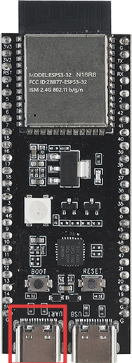
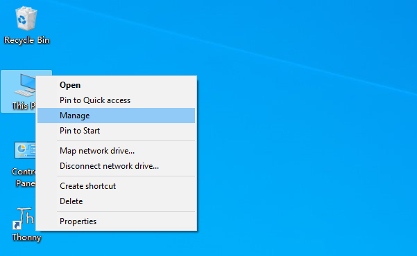
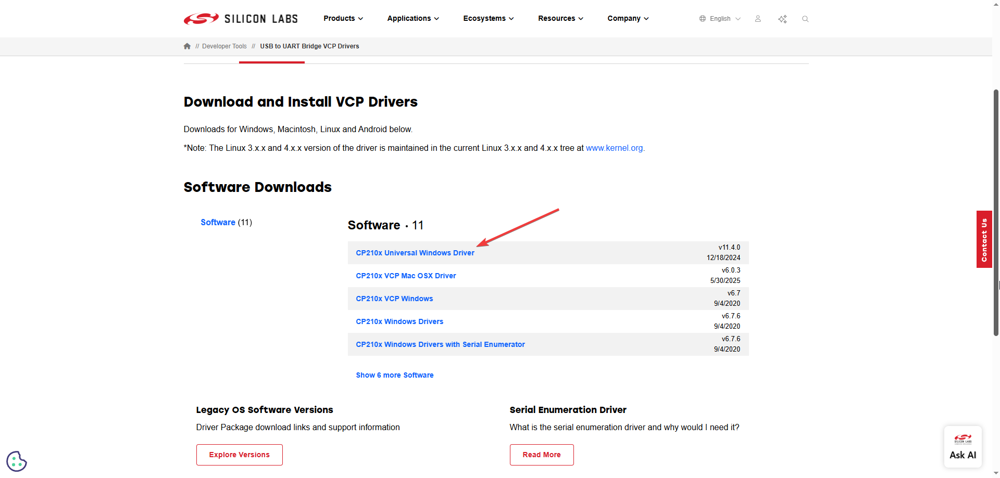

.. _install_driver:

Driver Installation
=========================

Windows System
^^^^^^^^^^^^^^^^^^^^^^^^^^^^^^^^^^^^^^^^^^

**Check If CP210X Is Already Installed**

ESP32-S3 uses CP210X for code downloading. Before using it, we need to install the CP210X driver on our computer.

1. Connect your computer and ESP32-S3 with a USB cable (connect to the port indicated by the red box)

2. Go to your computer's main interface, select "This PC" and right-click to select "Manage".

3. Click "Device Manager". If your computer has already installed CP210X, you will see "USB-Enhances-SERIAL CP210X (COMx)". You can then proceed to the next step.

**Installing CP210X**

1. First, download the CP210X driver. Click `here <https://www.silabs.com/developer-tools/usb-to-uart-bridge-vcp-drivers>`_ to download the appropriate driver for your operating system.

If you don't want to download the installation package from the website, you can open "LAFVIN-AIoT-Starter-Kit/CP210X", as we have already prepared the installation package.

You can install it following the video below

.. video:: img/driver_ins.mp4
    :width: 100%

MacOS Firmware Upload
---------------------------

MacOS systems do not require separate driver installation; the system will automatically recognize CP210X devices.

For firmware flashing steps, please refer to: :ref:`macos_firmware`