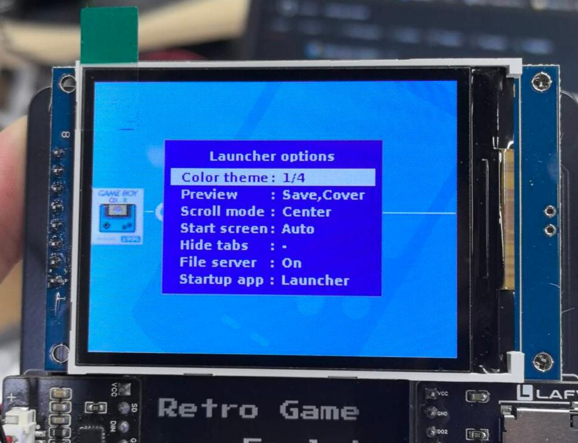
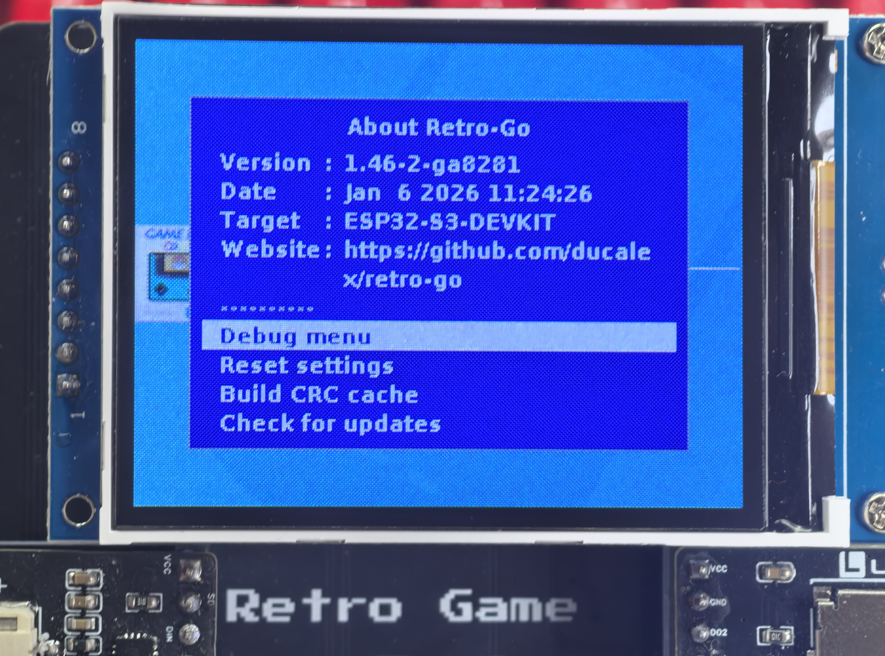
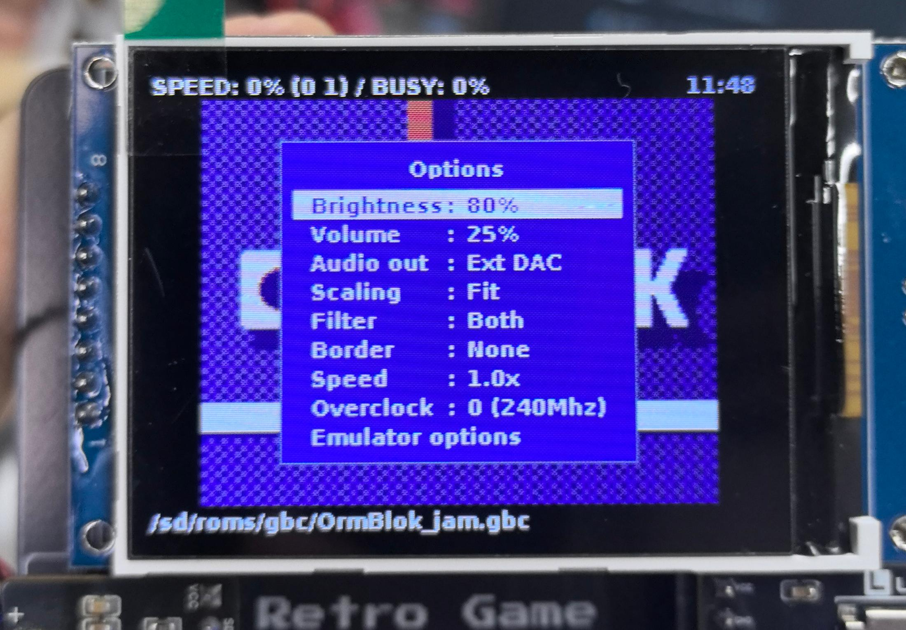
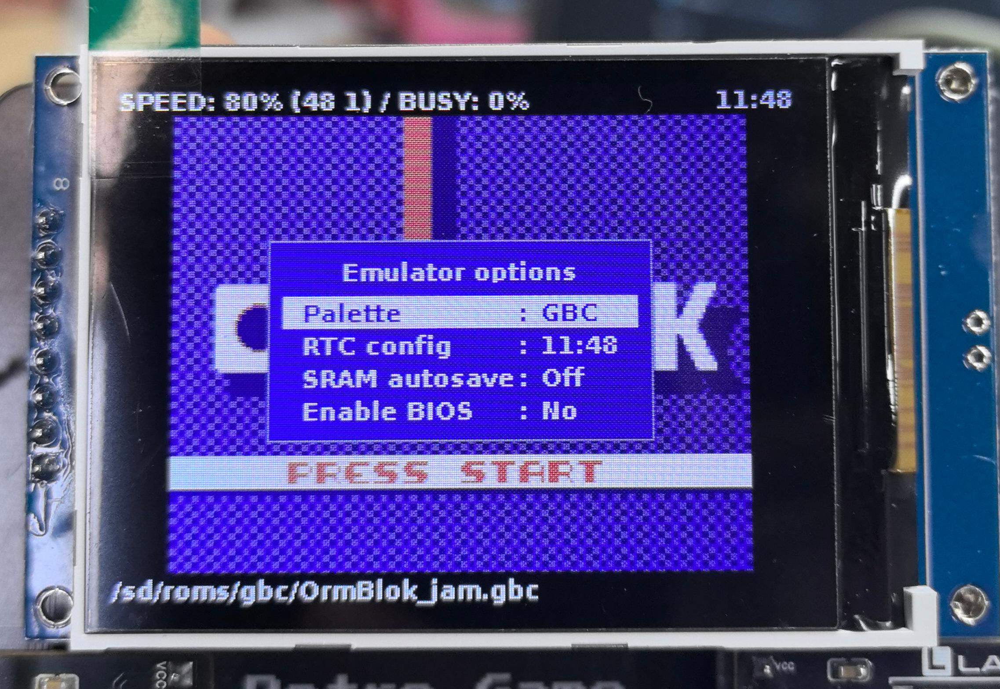

.. _advanced:

========================
Advanced Features
========================

Welcome to the Advanced Features chapter! This chapter introduces the advanced features and customization options of the LAFVIN Retro Game Kit to help you get a better user experience.

.. note::
   Advanced features require some understanding of the system. If you are a first-time user, it's recommended to read the :ref:`Usage Guide <usage>` chapter first.

System Settings
===============

Out-of-Game Options
-------------------

.. image:: img/advanced/游戏外选项1.jpg
   :alt: 游戏外选项界面1

**System Options Settings**

In this interface, you can adjust the following system parameters:

- **Brightness Adjustment** - Adjust screen brightness
- **Volume Control** - Set audio output volume
- **External DAC** - Enable/disable external digital audio converter
- **Font Settings** - Change system display font
- **Theme Management** - Select interface theme (requires theme files stored on SD card)
- **Time Settings** - Configure system time
- **Language Selection** - Switch system language
- **WiFi Settings** - Configure wireless network connection

**Launcher Options**

This interface is used to adjust launcher-related settings, including startup method, display options, etc.

**System Menu**

Contains system information and advanced settings options.

.. warning::
   Advanced settings options may affect system stability. If you don't understand their purpose, please do not modify them arbitrarily.

In-Game Settings
=================

In-Game Menu
------------

.. image:: img/advanced/游戏内菜单.jpg
   :alt: 游戏内菜单

**Quick Menu Functions**

While the game is running, you can access the following functions:

- **Save** - Save current game progress
- **Load** - Load saved game progress
- **Quit Game** - Return to launcher interface

In-Game Options
---------------

**Basic Options**

Similar to out-of-game options, with the following additional game-related settings:

- **Display Settings** - Adjust display effects and filters
- **Speed Control** - Adjust game running speed
- **Overclocking Options** - Boost performance (may affect stability)

**Emulator Advanced Options**

This interface contains professional configuration options for the emulator.

.. warning::
   Emulator advanced options involve low-level parameters. If you don't clearly understand their purpose, please do not modify them to avoid affecting game operation.

