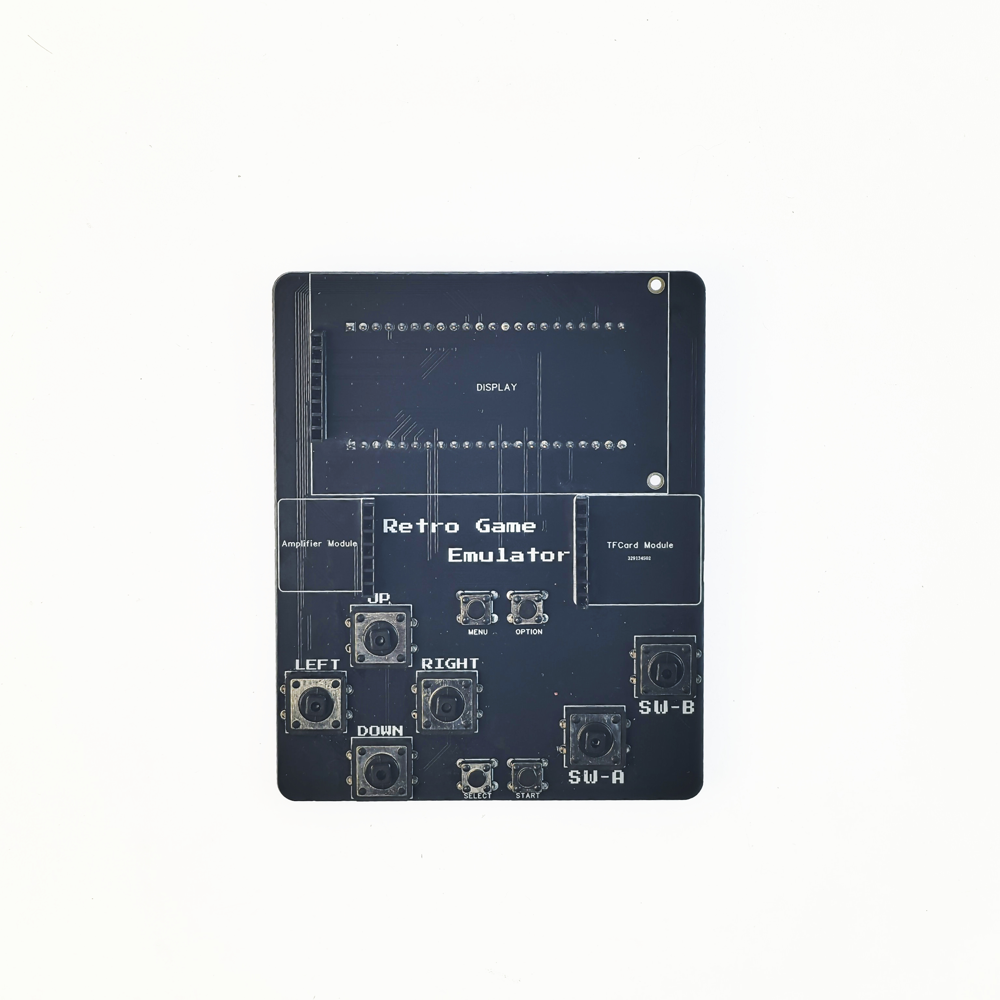
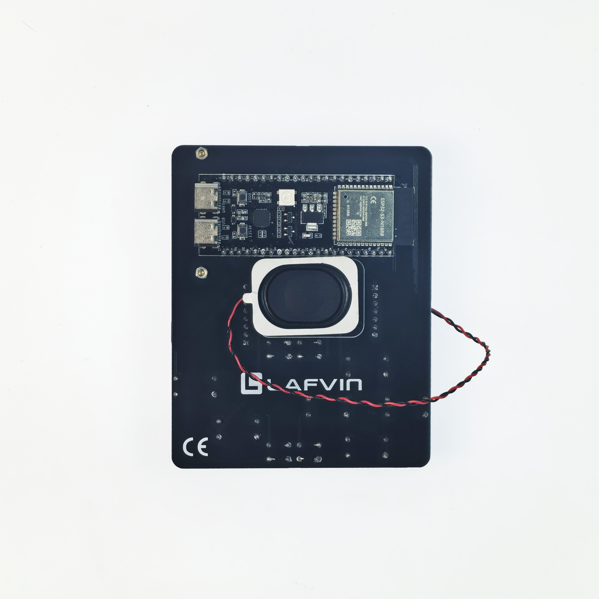
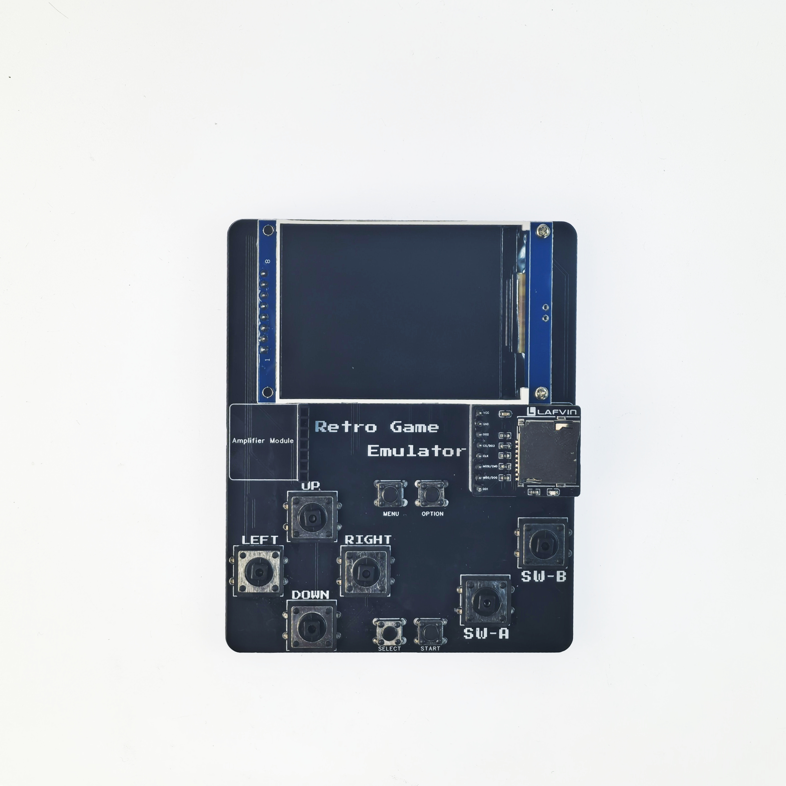
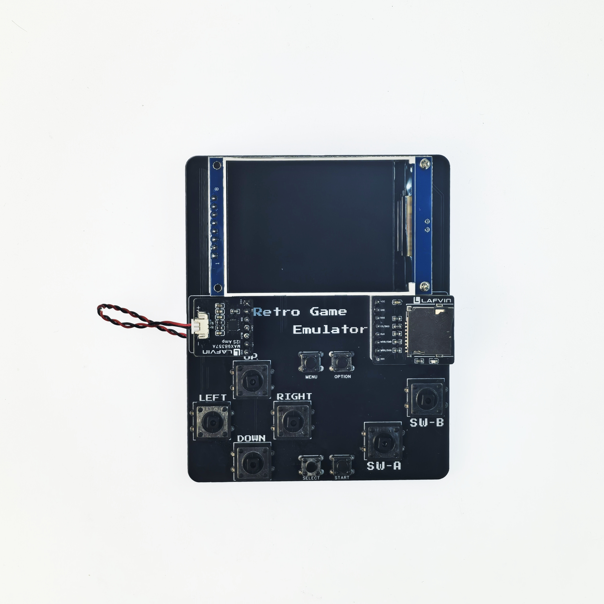
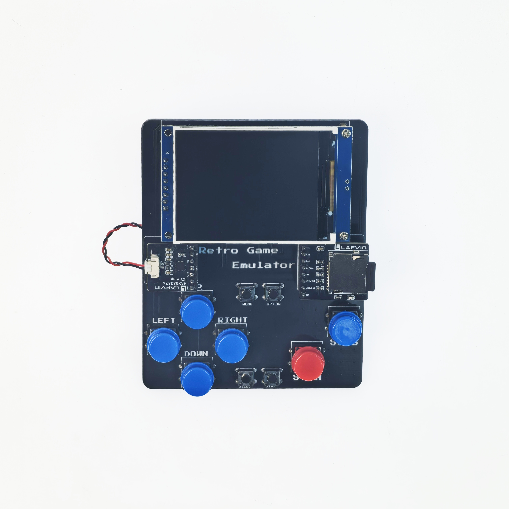
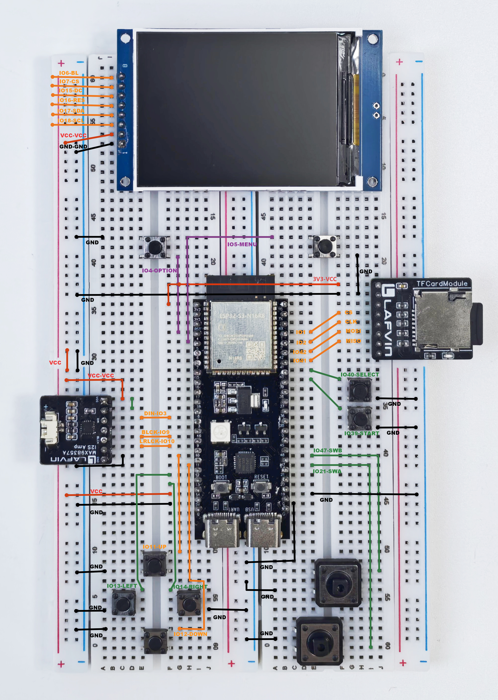
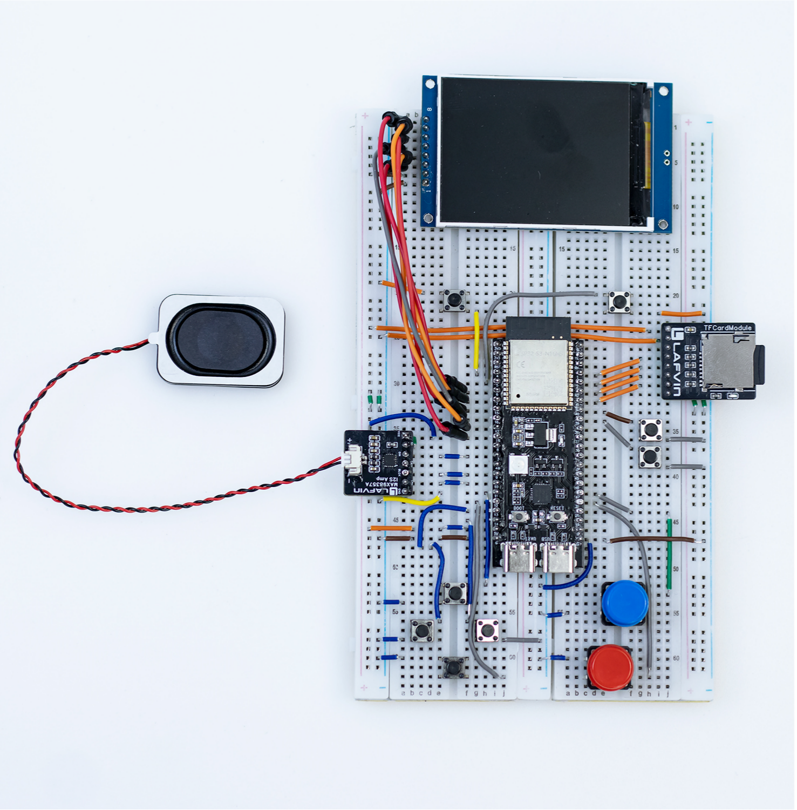

.. _assembly:

====================
组装教程(OK,缺图片)
====================

欢迎来到 LAFVIN Retro Game Kit 组装教程!本教程提供两种组装方式,您可以根据自己的需求和经验选择。

组装概述
========

LAFVIN Retro Game Kit 提供两种组装方式:

**方式一：快速组装模式（推荐新手）** → :ref:`快速跳转 <quick-assembly>`

- 使用 LAFVIN Retro Game Hub扩展底板
- 模块即插即用,无需接线
- 组装时间约 15-20 分钟
- 适合快速上手,开始游戏

**方式二：面包板模式（进阶玩家）** → :ref:`快速跳转 <breadboard-assembly>`

- 使用标准面包板自由布局
- 完全自定义硬件连接
- 组装时间约 40-60 分钟
- 适合学习硬件原理,便于调试和改装

.. list-table:: 两种组装方式对比
   :header-rows: 1
   :widths: 20 40 40

   * - 对比项
     - 快速组装模式
     - 面包板模式
   * - 难度
     - ⭐⭐ 简单
     - ⭐⭐⭐⭐ 进阶
   * - 组装时间
     - 10-15 分钟
     - 40-60 分钟
   * - 接线数量
     - 少（使用扩展底板）
     - 多（完全手动接线）
   * - 灵活性
     - 固定布局
     - 完全自定义
   * - 适合人群
     - 快速体验
     - 学习硬件
   * - 调试难度
     - 低
     - 中等
   * - 改装空间
     - 有限
     - 灵活

**我们推荐使用第一种组装方式,能快速检查硬件是否正常运转和熟悉软件功能**

.. warning::
   **重要提示：**
   
   无论选择哪种组装方式,请务必注意:
   
   - 在组装过程中,确保所有模块处于断电状态
   - 请勿在通电状态下插拔模块,可能导致硬件损坏
   - 仔细核对引脚连接,避免接错导致烧毁元件

所需工具
========

- 建议准备:镊子(用于整理跳线)
- 良好的照明环境
- 平整的工作台面

组件清单
========

在开始组装前,请确认您已收到全部所有组件, 详细清单请参考 :doc:`component_list`。

.. _quick-assembly:

方式一：快速组装模式
====================================

本方式使用 LAFVIN Retro Game 扩展底板,大部分连接已在底板上完成,您只需插入模块即可。

步骤 1: 准备扩展底板
--------------------

1.1 检查扩展底板
^^^^^^^^^^^^^^^^

取出 LAFVIN Retro Game 扩展底板,检查:

- 底板表面无损坏
- 所有插槽完好
- 引脚标识清晰可见

[占位符:需要扩展底板的整体图片,标注各个插槽位置]

步骤 2: 安装核心模块
--------------------

2.1 安装 ESP32S3 主控模块
^^^^^^^^^^^^^^^^^^^^^^^^^

ESP32S3N16R8 是整个游戏机的核心控制器。

**安装步骤:**

1. 将ESP32S3模块安装到地板背面的插槽
2. 确认模块方向:天线方向应该与板子丝印同方向
3. 将 ESP32S3 模块对准插槽,轻轻按下
4. 确保所有引脚完全插入,模块与底板紧密贴合

[占位符:ESP32S3 模块安装到扩展底板的图片]

.. warning::
   安装时请勿用力过猛,避免损坏引脚。如果引脚无法顺利插入,请检查引脚是否对齐。

2.2 安装 TFT 显示屏
^^^^^^^^^^^^^^^^^^^

**安装步骤:**

1. 找到扩展底板正面的上的DISPLAY区域
2. 将 2.4 英寸 TFT 显示屏的排针对准排母
3. 轻轻插入排母

.. image:: ./img/assembly/tft_on_board.jpg
   :alt: TFT 显示屏连接到扩展底板
   :align: center
   :width: 600px

[占位符:TFT 显示屏连接到扩展底板的图片]

2.3 安装 TFCard 模块
^^^^^^^^^^^^^^^^^^^^

**安装步骤:**

1. 找到扩展底板上标有 "TFCard Module"区域的插槽
2. 将 TFCard 模块排针对准排母
3. 确保 TF 卡插槽朝外,便于插拔 TF 卡
4. 轻轻按下,确保排针完全插入

[占位符:TFCard 模块安装到扩展底板的图片]

2.4 安装功放模块
^^^^^^^^^^^^^^^^

**安装步骤:**

1. 找到扩展底板上标有 "Amplifier Module" 的插槽
2. 将功放模块排针对准排母
3. 确保音频输出接口朝外
4. 轻轻按下,确保引脚完全插入,然后将扬声器安装到功放模块(有防呆接口)

[占位符:功放模块安装到扩展底板的图片]

步骤 3: 安装按键帽
------------------

我们给方向和AB按键提供了按键帽,可以将按键帽安装到按键上

.. image:: ./img/assembly/install_cap.jpg
   :alt: 安装按键帽
   :align: center
   :width: 600px

快速组装完成
------------

[占位符:使用扩展底板组装完成的整体效果图]

恭喜!您已完成快速组装。扩展底板大大简化了接线过程,可以进行 :ref:`固件烧录 <firmware>` 进行快速测试

.. _breadboard-assembly:

方式二：面包板模式
====================================

本方式使用标准面包板,需要手动完成所有接线。适合想深入了解硬件连接原理的进阶玩家。

步骤 1: 面包板准备
------------------

1.1 连接两块面包板
^^^^^^^^^^^^^^^^^^

**你可以参考我们的安装图,也可以自己设计自己的布局,连接图以及IO-模块对照表如下**

**TFT 显示屏引脚连接**

.. list-table:: TFT 显示屏引脚对应表
   :header-rows: 1
   :widths: 25 25 50

   * - TFT 引脚
     - ESP32S3 引脚
     - 说明
   * - BL
     - GPIO 6
     - 背光控制
   * - CS
     - GPIO 7
     - 片选信号
   * - DC
     - GPIO 15
     - 数据/命令选择
   * - RES
     - GPIO 16
     - 复位信号
   * - SDA
     - GPIO 17
     - SPI 数据输出
   * - SCL
     - GPIO 18
     - SPI 时钟
   * - VCC
     - 5V
     - 电源
   * - GND
     - GND
     - 地线

**TFCard 模块引脚连接**

.. list-table:: TFCard 模块引脚对应表
   :header-rows: 1
   :widths: 25 25 50

   * - TFCard 引脚
     - ESP32S3 引脚
     - 说明
   * - VCC
     - 3V3
     - 电源
   * - GND
     - GND
     - 地线
   * - DO2
     - NC
     - (不连接)
   * - CS
     - GPIO 1
     - 片选信号
   * - CLK
     - GPIO 2
     - SPI 时钟
   * - MOSI
     - GPIO 42
     - SPI 数据输出
   * - MISO
     - GPIO 41
     - SPI 数据输入
   * - DO1
     - NC
     - (不连接)

**功放模块引脚连接**

.. list-table:: 功放模块引脚对应表
   :header-rows: 1
   :widths: 25 25 50

   * - 功放引脚
     - ESP32S3 引脚
     - 说明
   * - VCC
     - 5V
     - 电源(注意是 5V!)
   * - GND
     - GND
     - 地线
   * - SD
     - VCC(与功放模块的VCC短接)
     - 功放使能(关断控制)
   * - DIN
     - GPIO 8
     - I2S 数据输入
   * - GAIN
     - NC
     - 增益控制(不连接)
   * - BCLK
     - GPIO 9
     - I2S 位时钟
   * - LRCLK
     - GPIO 10
     - I2S 左右声道时钟

**按键引脚连接**

.. list-table:: 按键引脚对应表
   :header-rows: 1
   :widths: 30 25 45

   * - 按键
     - ESP32S3 引脚
     - 说明
   * - 方向键 - 上
     - GPIO 11
     - 方向控制 - 上
   * - 方向键 - 下
     - GPIO 12
     - 方向控制 - 下
   * - 方向键 - 左
     - GPIO 13
     - 方向控制 - 左
   * - 方向键 - 右
     - GPIO 14
     - 方向控制 - 右
   * - A 键
     - GPIO 21
     - 游戏按键 A (确认/跳跃)
   * - B 键
     - GPIO 47
     - 游戏按键 B (取消/攻击)
   * - Start 键
     - GPIO 39
     - 开始/暂停游戏
   * - Select 键
     - GPIO 40
     - 选择功能
   * - Menu 键
     - GPIO 5
     - 打开系统菜单
   * - Option 键
     - GPIO 4
     - 选项设置

每个按键的一端连接到对应的 GPIO 引脚,另一端连接到 GND(地线)。ESP32S3 内部会启用上拉电阻,按键按下时引脚电平变为低电平。

.. warning::
   **电源连接至关重要!**
   电源和地如果连接错误可能会导致短路以及损坏硬件

.. tip::
   **接线技巧:**
   
   - 一次只连接一个模块,连接完成后再进行下一个
   - 使用不同颜色的跳线区分不同功能
   - 拍照记录接线过程,便于后续检查
   - 使用镊子调整跳线位置

面包板模式组装完成
---------------------------

恭喜!您已完成面包板模式的组装。这种方式虽然复杂,但让您完全掌握了硬件连接原理。

.. image:: ./img/assembly/breadboard_connect_done.jpg
   :alt: 面包板模式组装完成效果
   :align: center
   :width: 800px

**通电前最后确认(两种方式通用)**

.. danger::
   **在首次通电前,请务必完成以下最后确认:**
   
   1. ✓ 电源连接正确
   2. ✓ 无短路现象(电源和地线未接触)
   3. ✓ 所有模块安装牢固
   4. ✓ 引脚连接已按表格核对
   5. ✓ TFT 显示屏排线连接正确
   
   **如有任何疑问,请勿通电!先检查连接!**

组装完成
========

无论您选择哪种组装方式,现在硬件部分已经完成。

下一步
======

硬件组装完成后,您需要:

1. :doc:`tfcard` - 准备和格式化 TF 卡
2. :doc:`firmware` - 烧录固件到 ESP32S3
3. :doc:`usage/usage` - 学习如何使用游戏机

如果在组装过程中遇到问题,请参考 :doc:`troubleshooting/troubleshooting`。

遇到问题？
==========

如果您在组装过程中遇到困难,请查看 :ref:`assembly-troubleshooting` 获取详细的故障排除指南。

您也可以:

- 访问 LAFVIN 官方网站获取更多资源
- 联系技术支持团队

祝您组装顺利,游戏愉快!
