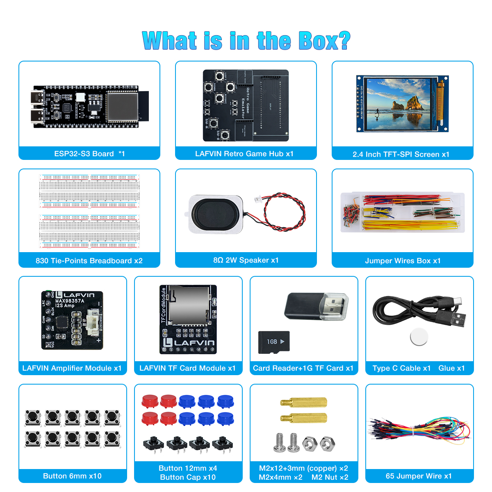
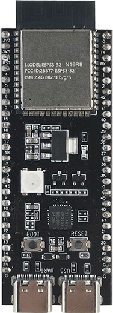
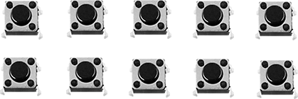

.. _component_list:

Component List (OK, Images Needed)
===================================

Kit Components Overview
-----------------------

Component List Table
--------------------

The following are all components included in the LAFVIN Retro Game Kit:

.. list-table::
   :header-rows: 1
   :widths: 10 40 15 35

   * - No.
     - Component Name
     - Quantity
     - Description
   * - 1
     - ESP32S3 Module (Confirmed)
     - 1
     - Main controller, 16MB Flash + 8MB PSRAM
   * - 2
     - LAFVIN TFCard Module (Confirmed)
     - 1
     - TF card reader module for storing game files
   * - 3
     - LAFVIN Amplifier Module (Confirmed)
     - 1
     - Audio output module to drive speaker
   * - 4
     - LAFVIN Retro Game Hub (Confirmed)
     - 1
     - Dedicated expansion board to simplify connections
   * - 5
     - 2.4 Inch TFT-SPI Screen (Confirmed)
     - 1
     - Color display, 320x240 resolution
   * - 6
     - Button (6x6mm) (Confirmed)
     - 10
     - Game control buttons (D-pad, function keys, etc.)
   * - 7
     - Button (12x12mm) (Confirmed)
     - 4
     - Breadboard A/B buttons
   * - 8
     - Button Cap (Confirmed)
     - 4
     - Button caps for large buttons, improves feel
   * - 9
     - 830 Breadboard (Confirmed)
     - 2
     - For circuit assembly
   * - 10
     - Jumper Wires Box (Confirmed)
     - Several
     - Fixed-length jumper wires for module connections
   * - 11
     - 65 Jumper Wire (Confirmed)
     - Several
     - Flexible jumper wires for button connections
   * - 12
     - Type C Cable (Confirmed)
     - 1
     - For power supply and firmware flashing
   * - 13
     - 8Ω2W Speaker (Confirmed)
     - 1
     - Audio output device
   * - 14
     - Memory Card (Confirmed)
     - 1
     - For storing game ROM files
   * - 15
     - Memory Card Reader (Confirmed)
     - 1
     - For storing game ROM files
   * - 16
     - M2x4mm Screw Set (Confirmed)
     - 2
     - Includes screws, pillars & nuts

Main Component Details
----------------------

ESP32S3N16R8 Controller Module
~~~~~~~~~~~~~~~~~~~~~~~~~~~~~~

**Key Features:**

- Chip Model: ESP32-S3
- Flash Capacity: 16MB
- PSRAM Capacity: 8MB
- Dual-core processor, up to 240MHz
- Supports Wi-Fi and BLE 5.0
- Rich GPIO interfaces

**Function:** Serves as the core processor of the gaming console, responsible for running game emulators, handling graphics rendering, audio output, and user input.

LAFVIN TFCard Module
~~~~~~~~~~~~~~~~~~~~

.. image:: ./img/components/tfcard_module.jpg
   :align: center
   :width: 400px

[占位符:TFCard 模块图片]

**Key Features:**

- Supports standard TF cards (Micro SD cards)
- Supports FAT32 file system
- SPI interface communication
- Supports hot-swapping

**Function:** Reads game ROM files stored on the TF card, providing game data for emulators.

LAFVIN Amplifier Module
~~~~~~~~~~~~~~~~~~~~~~~

.. image:: ./img/components/amplifier.jpg
   :align: center
   :width: 400px

[占位符:功放模块图片]

**Key Features:**

- Built-in audio amplifier chip
- Supports mono output
- Adjustable volume
- Low power consumption design

**Function:** Amplifies audio signals and drives the speaker, providing game sound effects and background music output.

2.4 Inch TFT Display
~~~~~~~~~~~~~~~~~~~~

.. image:: ./img/components/tft_screen.jpg
   :align: center
   :width: 400px

[占位符:TFT 显示屏图片]

**Key Features:**

- Size: 2.4 inches
- Resolution: 320x240 pixels
- Color display, supports 65K colors
- SPI interface
- Wide viewing angle

**Function:** Displays game screens, menu interfaces, and system information.

LAFVIN Retro Game Expansion Board
~~~~~~~~~~~~~~~~~~~~~~~~~~~~~~~~~~

.. image:: ./img/components/extension_board.jpg
   :align: center
   :width: 400px

[占位符:扩展底板图片]

**Key Features:**

- Designed specifically for Retro Game Kit
- Standard interface reserved
- Simplifies module connections
- Provides stable power distribution

**Function:** Serves as the connection hub for all modules, simplifying the assembly process and providing stable electrical connections.

Button Components
~~~~~~~~~~~~~~~~~

[占位符:按键组件图片,包括小按钮和大按钮]

**Small Buttons (6x6mm):**

- Quantity: 10 pieces
- Usage: For building D-pad (up, down, left, right), Menu, Option, Start, Select, and other function keys on breadboard
- Tactile buttons with crisp feel

**Large Buttons (12x12mm):**

- Quantity: 4 pieces
- Usage: For building A and B buttons on breadboard
- Comes with button caps to improve operation feel

**Function:** Provides user input interface to control game characters and system menus.

Power Supply Instructions
-------------------------

.. note::
   This kit is powered through a **Type-C interface**, no external battery required.

**Power Supply Method:**

- Use a standard Type-C data cable to connect to the ESP32S3 controller module
- Recommended to use a 5V/2A or higher power USB adapter
- Can also be powered through a computer USB port (ensure sufficient power supply)

**Power Supply Precautions:**

.. warning::
   - Please use reliable Type-C data cables and power adapters
   - Insufficient power may cause screen flickering, audio anomalies, or system instability
   - Do not plug or unplug modules while powered on to avoid hardware damage

Checklist
---------

After receiving the kit, please check the components according to the following checklist:

.. tip::
   If you find missing or damaged components, please contact after-sales service promptly.

Next Steps
----------

After confirming all components are complete, you can continue to:

- :ref:`Download Files <download_code>` - Download code and related files
- :ref:`Assembly Tutorial <assembly>` - Learn how to assemble the gaming console
- :ref:`TF Card Preparation <tfcard>` - Prepare TF card and game files
- :ref:`Firmware Flashing <firmware>` - Flash firmware to ESP32S3
