.. _firmware:

==================
Firmware Flashing (OK, Images Needed)
==================

The LAFVIN Retro Game Kit uses open-source firmware that needs to be flashed to the ESP32S3 controller module for proper operation. This chapter will guide you through the firmware download, flashing, and verification process.

.. note::
   Firmware flashing is a one-time operation. Unless you need to update the firmware version, there's no need to repeat the flashing process.

Before flashing, you need to install the CP210X driver first. Please refer to :ref:`install_driver` 

Windows System Firmware Flashing
=================================

**If you are using Windows, you can follow the tutorial below to flash firmware to ESP32S3**

1. Double-click to open Flash Download Tools, then select the options as shown below:

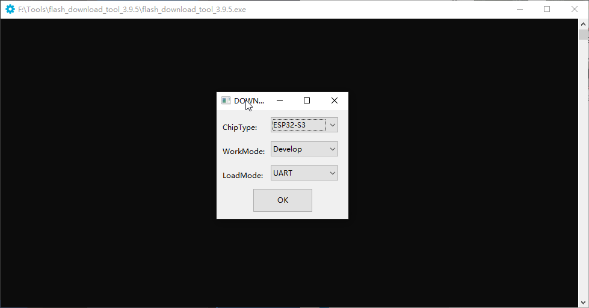

2. Follow these steps to upload the firmware:

A. Click the "Select File" button to choose your downloaded firmware file (.img format)
    
B. In the address input box after the bin file selection box, enter 0 or 0x0 (this means the firmware will be downloaded to the starting position of the development board's memory)
    
C. Select the COM port corresponding to ESP32-S3 from the port selection dropdown menu (you can check it in Windows Device Manager)
    
D. Set the baud rate (we use 115200 here)
    
E. Click the "START" button to begin downloading the firmware to the ESP32-S3 development board

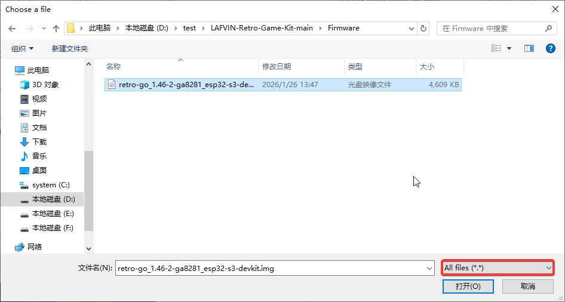

After download is complete, press the RST button on the development board. The board will automatically restart and enter the emulator selection interface.

.. _macos_firmware:

MacOS System Firmware Flashing
===============================

**If you are a MacOS user, you can refer to the tutorial below**

Step 1: Prepare Firmware Files
-------------------------------

1. Ensure you have downloaded and extracted the firmware locally

2. We have stored the bin files in the Firmware folder

.. image:: 项目在macos下文件夹的图片

3. We need to prepare a Type-C to USB-A data cable to connect your Mac computer and the development board

4. Open the `Online Flash Tool <https://espressif.github.io/esp-launchpad/>`_ (This is Espressif's official online flashing tool)

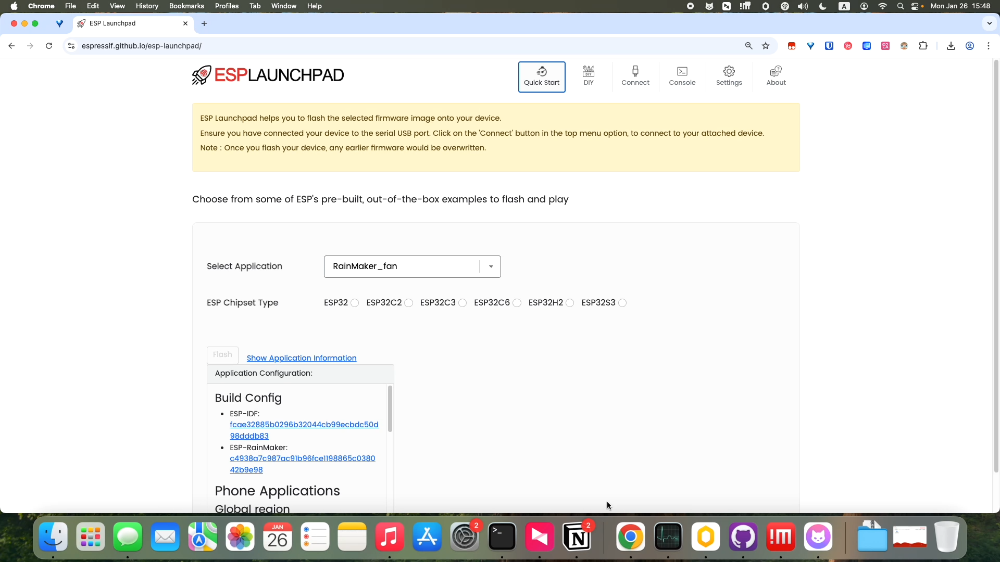

5. Click the Connect button at the top, and a window will pop up on the left side to select your device and connect

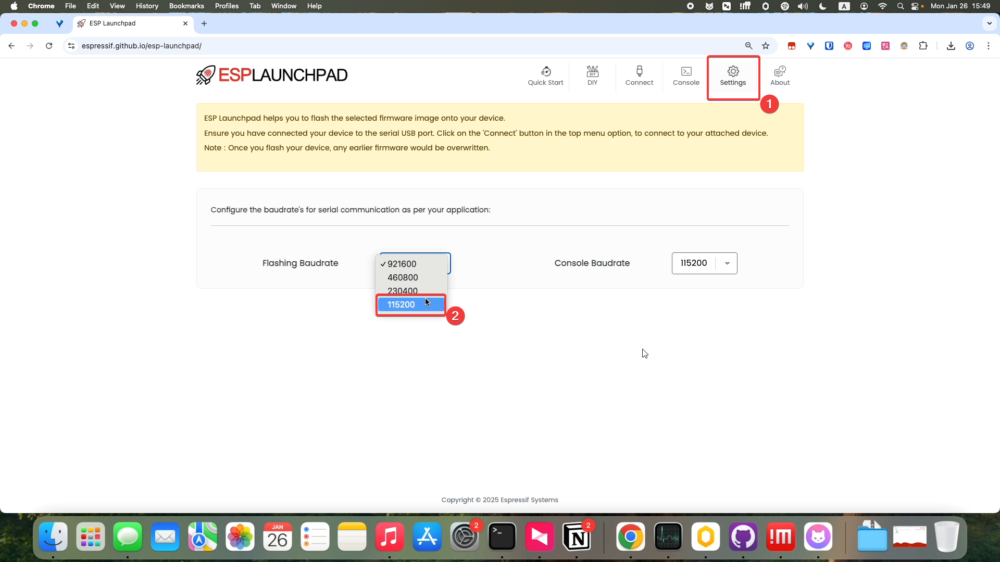

6. After the connection is complete, you can see that the Connect button changes to Disconnect, indicating successful connection. Click the DIY button

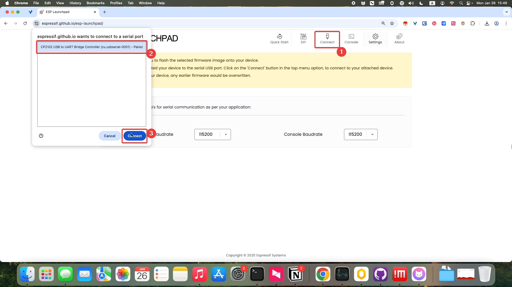

7. Fill in 0 in the Flash Address field, and select Firmware in the Selected File section

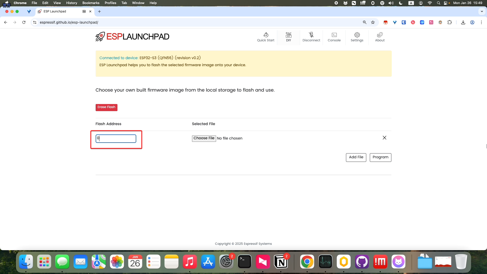

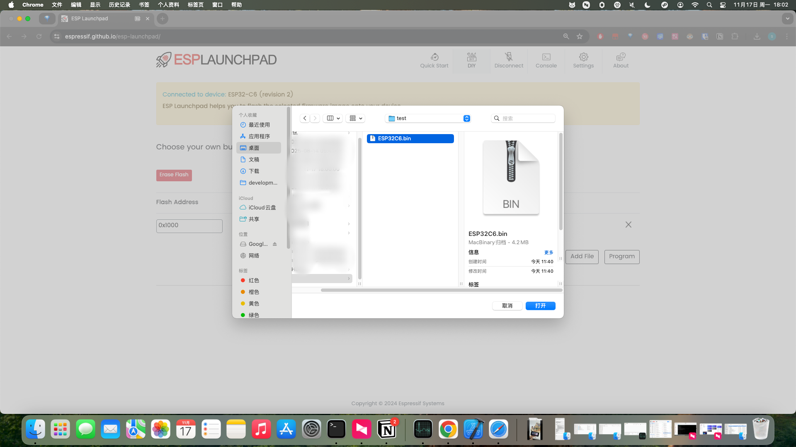

8. After selection is complete, click the Program button to start flashing

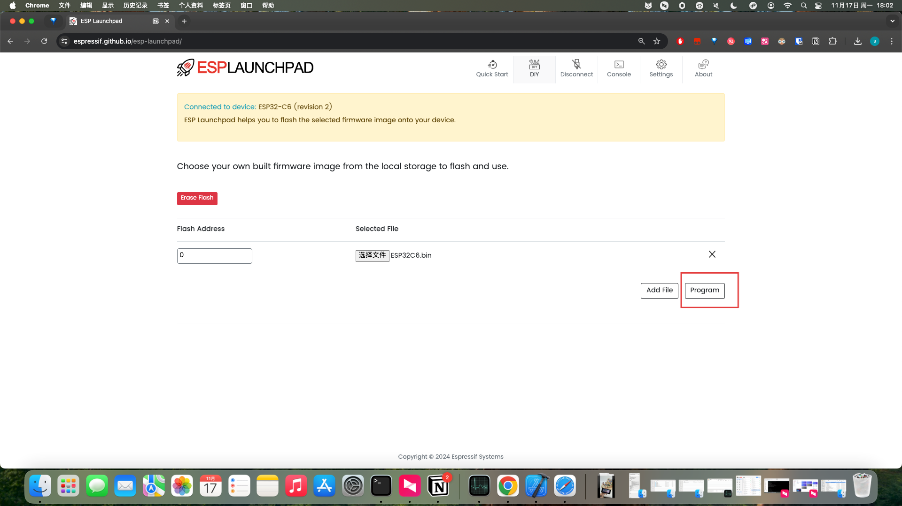

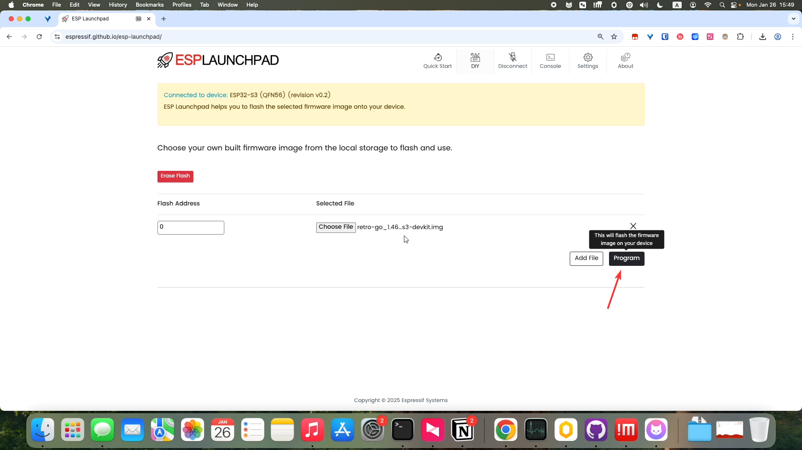

9. After flashing is complete, click the Reset Device button in the upper right corner to restart the device, and you will see the screen display normally

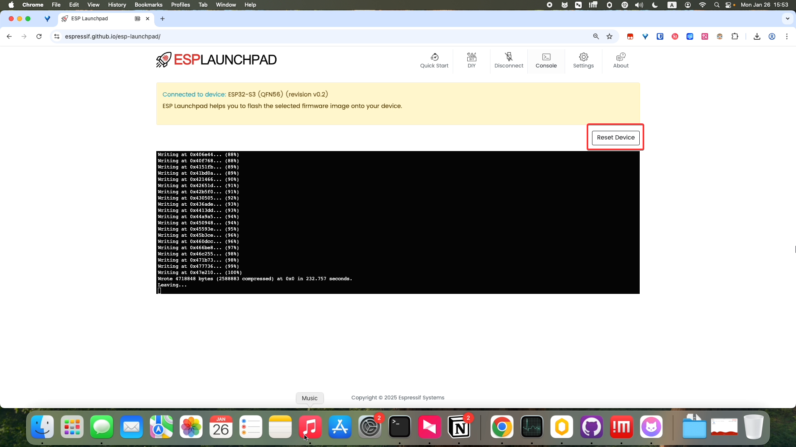

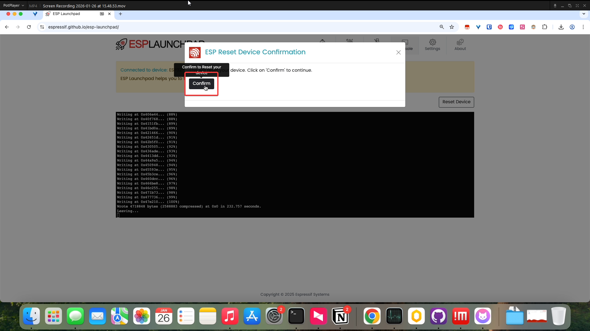
