.. _tfcard:

====================
TF Card Preparation
====================

The LAFVIN Retro Game Kit uses a TF card (also known as MicroSD card) to store game files. The TF card is read through the LAFVIN TFCard module, providing large-capacity game storage for the gaming console.

The kit includes a 1GB SD card (you can also use your own memory card)

.. tip::
   The actual number of games that can be stored depends on the game file sizes. Early platform games (such as NES, GB) have smaller file sizes, while later platform games (such as SNES, MD) have larger file sizes.

Preparation Steps
=================
Before using the TF card, you need to complete the following steps:

Format SD Card
^^^^^^^^^^^^^^

Before starting the tutorial, we need to create a drive letter for the blank SD 
card and format it. This step requires a card reader and SD card. Please prepare 
them in advance. Below we will guide you to do it on different computer systems. 
You can choose the guide that matches your computer. 

**Windows**

1. Insert the SD card into the card reader, then insert the card reader into the 
computer. In the Windows search box, enter "Disk Management" and select "Create 
and format hard disk partitions".

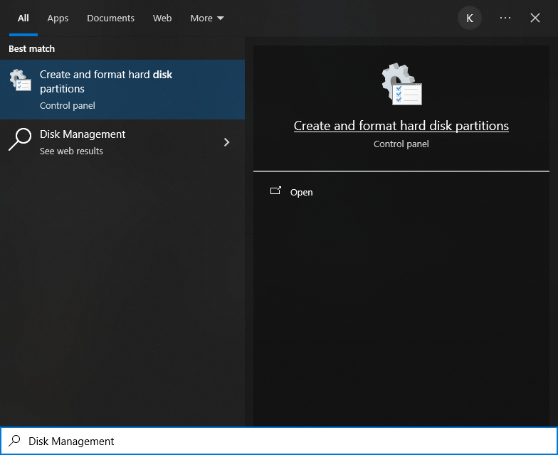

2. In the new pop-up window, find an unallocated volume close to 1G in size.

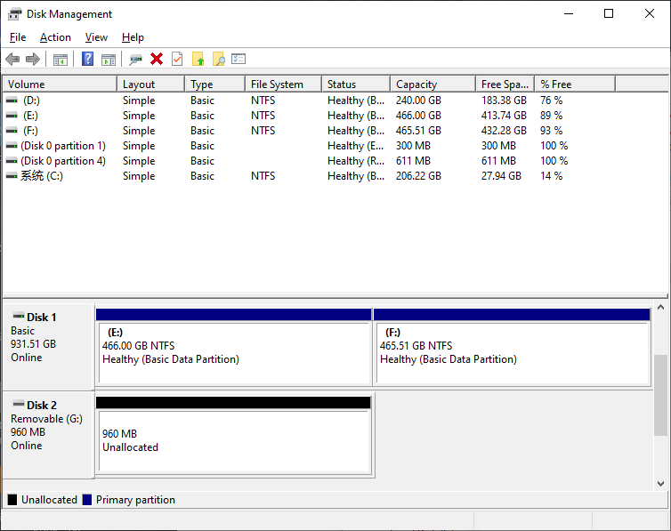

3. Click to select the volume, right-click and select "New Simple Volume".

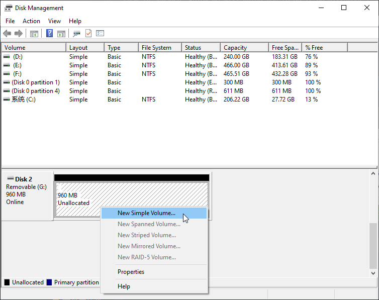

4. Click Next.

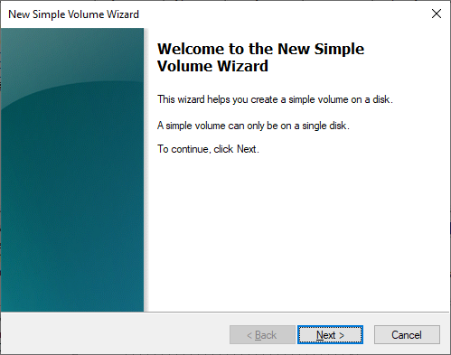

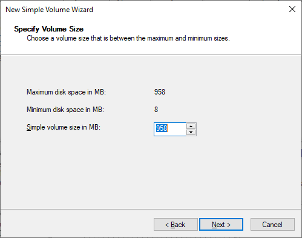

5. You can choose the drive letter on the right, or you can choose the default. By 
default, just click Next.

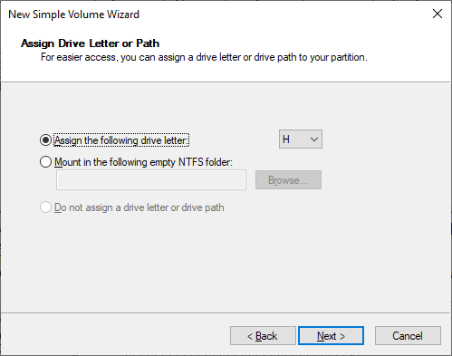

6. File system is FAT (or FAT32). The Allocation unit size is 16K, and the Volume 
label can be set to any name. After setting, click Next. (Note: If your card is larger than 2GB, it's recommended to use FAT32 formatting)

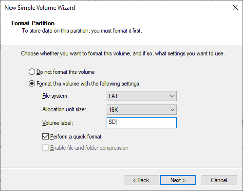

7. Click Finish. Wait for the SD card initialization to complete.

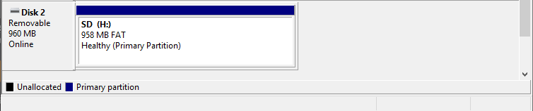

8. At this point, you can see the SD card in This PC.

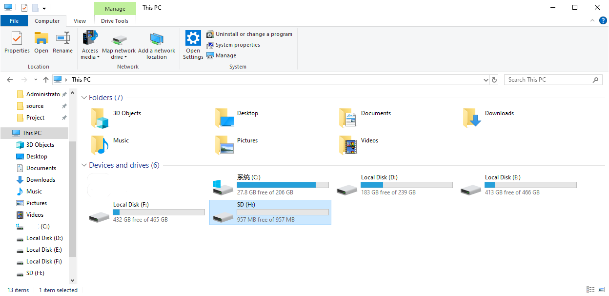

**MAC**

1. Insert the SD card into the card reader, then insert the card reader into the 
computer. Some computers will prompt the following information, please click to 
ignore it.

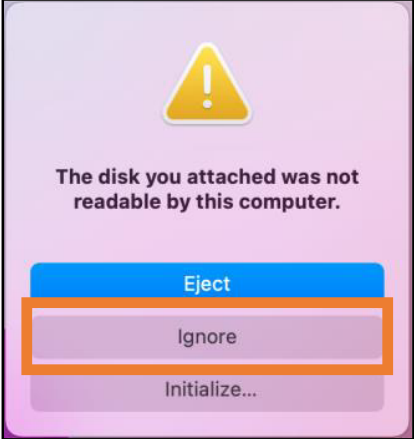

2. Find "Disk Utility" in the MAC system and click to open it.

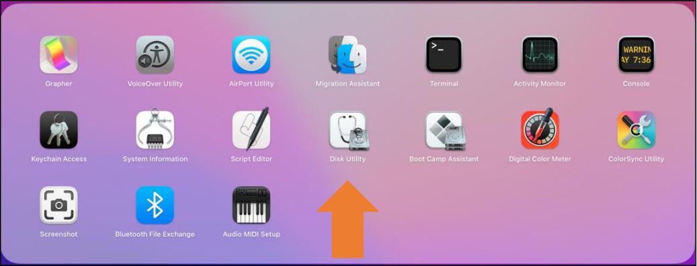

3. Select "Generic MassStorageClass Media", note that its size is about 1G. Please 
do not choose the wrong item. Click "Erase".

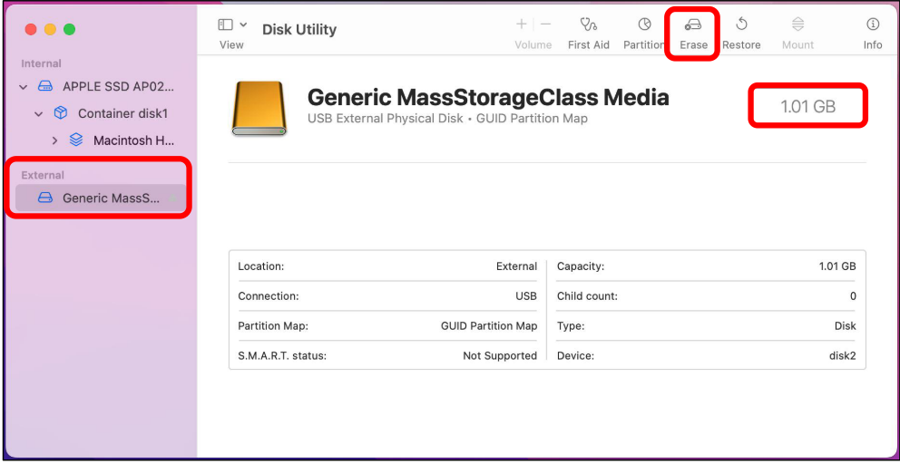

4. Select the configuration as shown in the figure below, and then click "Erase".

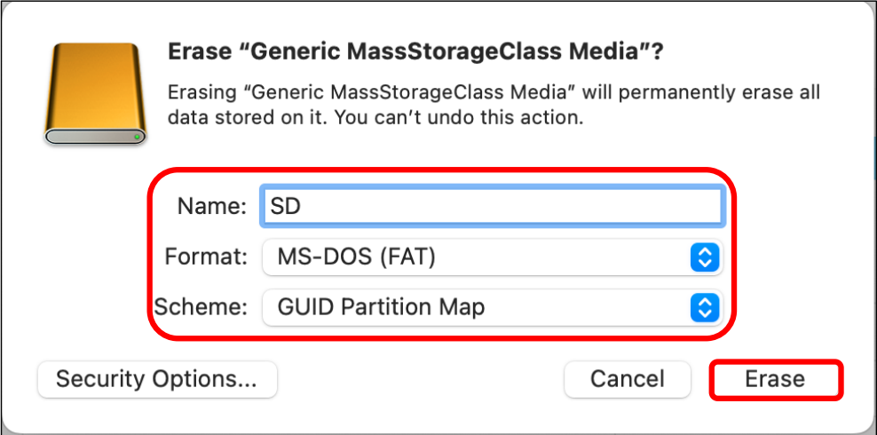

5. Wait for the formatting to complete. When finished, it will look like the picture 
below. At this point, you can see a new disk on the desktop named "SD".

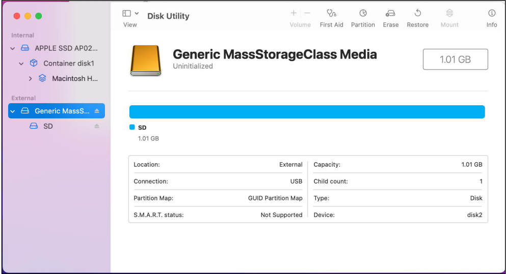

Import Game Files to SD Card
^^^^^^^^^^^^^^^^^^^^^^^^^^^^^

1. Open the SD card using a card reader. You can open the SDCardFiles folder from the previously downloaded and extracted zip package, and copy all files to the SD card root directory.

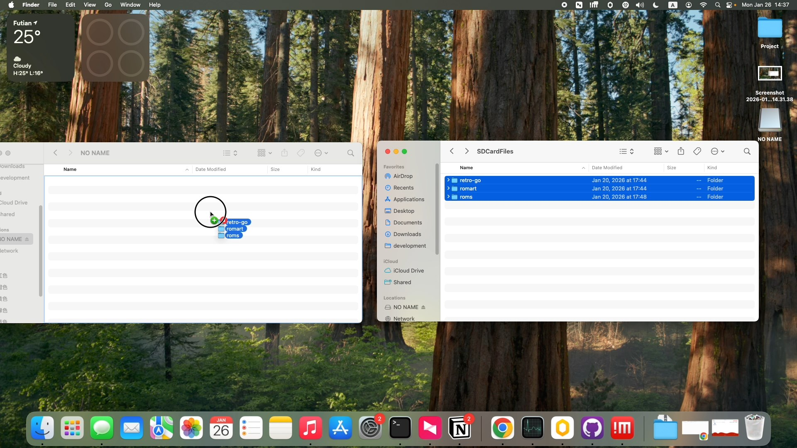

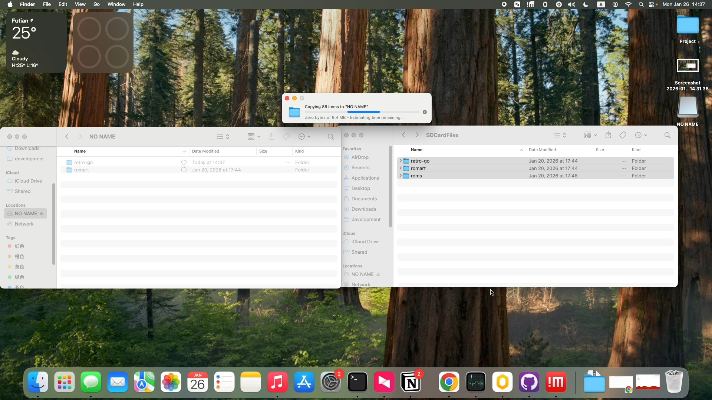

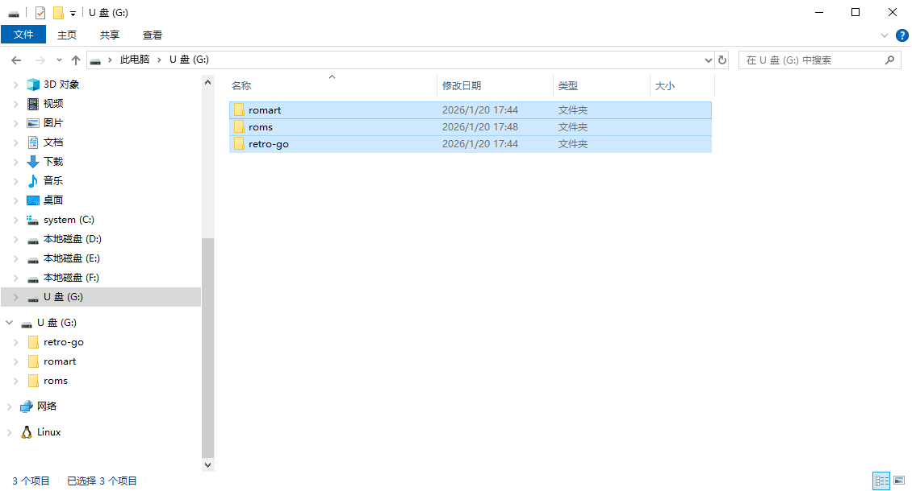

.. note:: We have already organized the relevant folder structure. You only need to add your own ROM files to the corresponding platform folders to run them.

Common Issues
=============

What to Do If TF Card Cannot Be Recognized?
--------------------------------------------

If the gaming console cannot recognize the TF card, please check:

1. Is the TF card properly inserted into the TFCard module
2. Is the TF card formatted as FAT32 file system
3. Is the TF card physically damaged
4. Is the TFCard module properly connected to ESP32S3

For detailed troubleshooting methods, please refer to :doc:`Appendix/Troubleshooting/troubleshooting`.

Where to Get Game Files?
-------------------------

.. note::
   Users need to prepare legal game files themselves. Please ensure you have legal rights to use the games.

You can:

- Extract ROM files from game cartridges you own
- Use homebrew games
- Use open-source games

Out of respect for copyright, this device comes preloaded with open-source games and test firmware. If you want to get more games, we recommend visiting itch.io Retro section or PDROMS to download legal Homebrew games.
