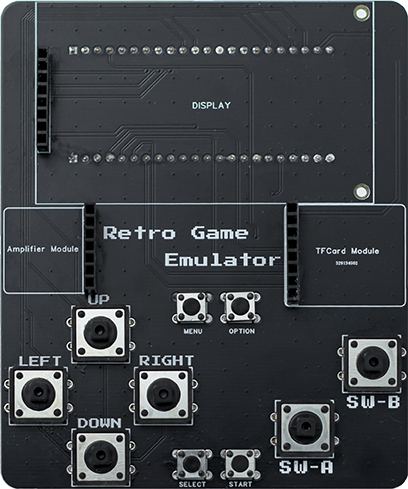

.. _buttons:

================
Button Guide
================

Button Layout
=============

Button Functions
================

Game Control Buttons
--------------------

.. list-table::
   :header-rows: 1
   :widths: 20 80

   * - Button
     - Function
   * - D-pad (Up)
     - Control game character to move up or menu selection up
   * - D-pad (Down)
     - Control game character to move down or menu selection down
   * - D-pad (Left)
     - Control game character to move left or menu selection left
   * - D-pad (Right)
     - Control game character to move right or menu selection right
   * - A Button
     - Confirm/Jump/Attack
   * - B Button
     - Cancel/Return/Special function

System Function Buttons
-----------------------

.. list-table::
   :header-rows: 1
   :widths: 20 80

   * - Button
     - Function
   * - Start Button
     - Start game/Pause game
   * - Select Button
     - Select/Switch options
   * - Menu Button
     - Open system menu
   * - Option Button
     - Open option settings

.. note::
   Button mappings for different gaming platforms may vary slightly. For specific functions, please refer to each emulator's instructions.

.. tip::
   It's recommended to familiarize yourself with the button layout before starting games for a better gaming experience.
