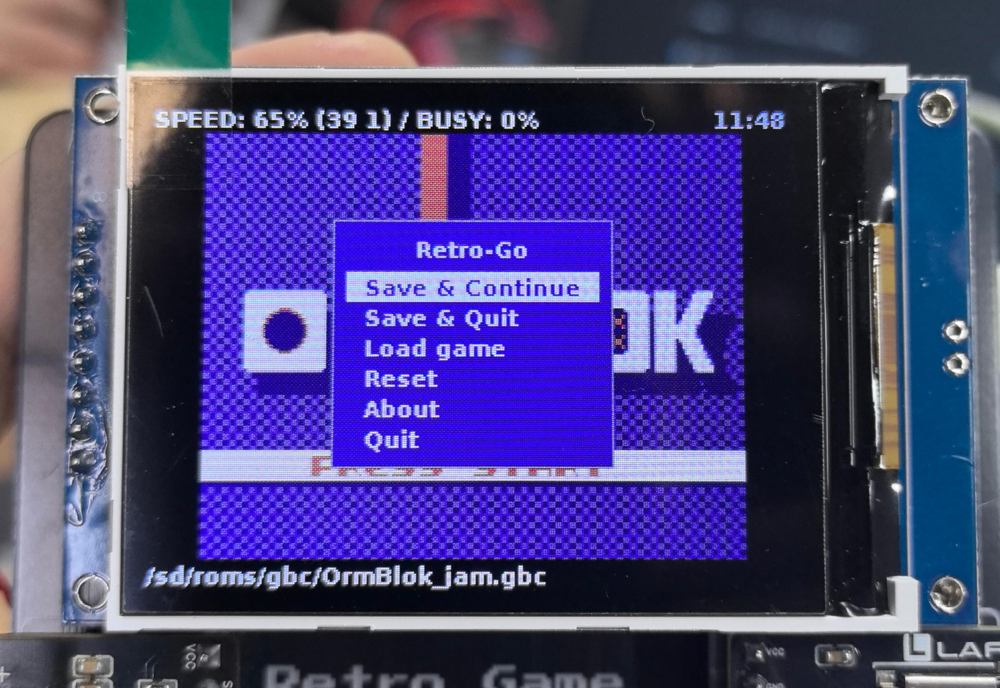
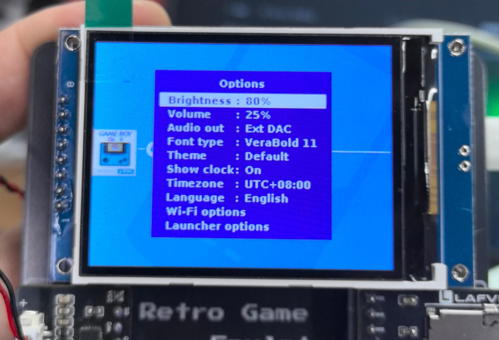

.. _settings:

============
Settings Guide
============

Settings Menu Overview
======================

This system provides two independent settings menus, each with different functions:

.. list-table:: Menu Comparison
   :header-rows: 1
   :widths: 20 40 40

   * - Menu Type
     - Function Description
     - How to Open
   * - **Option Menu**
     - System global settings (volume, brightness, language, theme, etc.)
     - Press **Option** button
   * - **Menu Menu**
     - In-game operations (save, load, etc.)
     - Press **Menu** button during gameplay

.. image:: ../img/usage/游戏内选项1.jpg
   :align: left
   :width: 400px

.. note::
   - **Option Menu**: Can be opened from main interface or during gameplay to modify system-level settings
   - **Menu Menu**: Only available during gameplay, used for in-game operations

Volume Adjustment
=================

Adjusting Volume Level
----------------------

**Steps:**

1. Press **Option** button to open system menu
2. Select **Volume** option
3. Use directional keys (left/right) to adjust volume level
4. Volume range: 0-100 (0 is mute, 100 is maximum volume)
5. Press **B** button to return and automatically save settings

.. tip::
   Volume settings take effect immediately - you can listen while adjusting.

Brightness Adjustment
=====================

Adjusting Screen Brightness
----------------------------

**Steps:**

1. Press **Option** button to open system menu
2. Select **Brightness** option
3. Use directional keys (left/right) to adjust screen brightness
4. Brightness range: 0-100 (recommended setting: 70-90)
5. Press **B** button to return and automatically save settings

.. list-table:: Brightness Adjustment Quick Operations
   :header-rows: 1
   :widths: 30 70

   * - Operation
     - Description
   * - Directional key (right)
     - Increase brightness (+10)
   * - Directional key (left)
     - Decrease brightness (-10)
   * - B button
     - Save and return

.. tip::
   - Adjust brightness according to ambient lighting to avoid eye fatigue

Game Speed Adjustment
=====================

Adjusting Game Running Speed
-----------------------------

In some cases, you may need to adjust the game's running speed (such as practicing difficult levels or speed running).

**Steps:**

1. Press **Option** button during gameplay to open menu
2. Select **Speed** option
3. Use directional keys (left/right) to select speed multiplier
4. Available speeds: 0.5x, 1.0x (normal), 1.5x, 2.0x
5. Press **B** button to return and save settings

.. list-table:: Speed Multiplier Description
   :header-rows: 1
   :widths: 20 80

   * - Speed Multiplier
     - Use Case
   * - 0.5x
     - Slow mode, suitable for practicing high-difficulty levels or precise operations
   * - 1.0x
     - Normal speed (default), authentic game experience
   * - 1.5x
     - Fast mode, suitable for repetitive levels
   * - 2.0x
     - Super fast mode, suitable for speed running or skipping cutscenes

.. warning::
   - Modifying game speed may affect audio synchronization and game experience
   - Some games may experience lag or anomalies at non-normal speeds
   - Recommended to play at normal speed (1.0x) for best experience

Language Switching
==================

Switching Interface Language
-----------------------------

The system supports multiple interface languages for users in different regions.

**Steps:**

1. Press **Option** button on launcher interface to open system menu
2. Select **Language** option
3. Press **A** button to enter language selection submenu
4. Use directional keys (up/down) to browse available languages
5. Press **A** button to confirm selection - system will automatically switch language and return to main interface

Supported Languages
-------------------

.. list-table:: Available Languages List
   :header-rows: 1
   :widths: 30 30

   * - Language
     - Language
   * - English
     - English
   * - Deutsch
     - German
   * - Français
     - French

.. note::
   - Language settings only affect system menus and interface text
   - Does not affect in-game content language (game language is determined by the ROM itself)
   - Language settings take effect immediately and are automatically saved

Other Settings Options
======================

The system also provides the following advanced settings options that can be adjusted according to personal preferences:

Audio Output (Audio Out)

Theme (Theme)

Font Type (Font Type)

Launcher Options (Launcher Options)

Time Zone Settings (Time Zone)

Set system time zone, affects save timestamps and in-game clock:

For detailed usage methods and advanced features of the above settings options, please visit the original project homepage for complete documentation:
   
 - GitHub Project: [https://github.com/ducalex/retro-go]